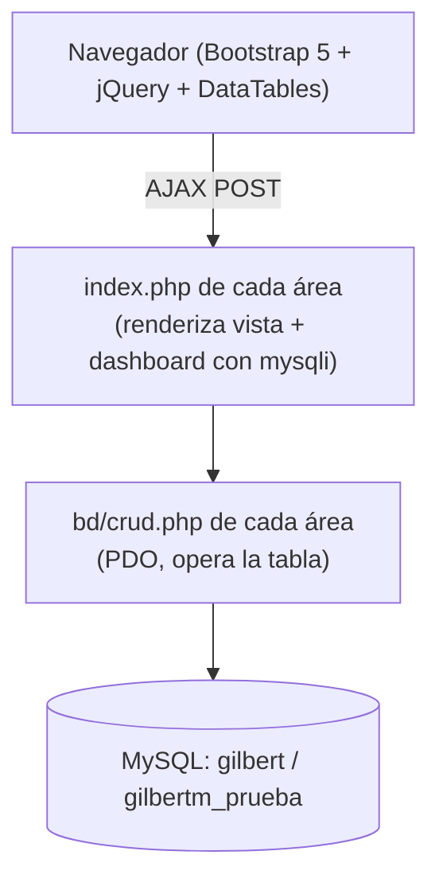
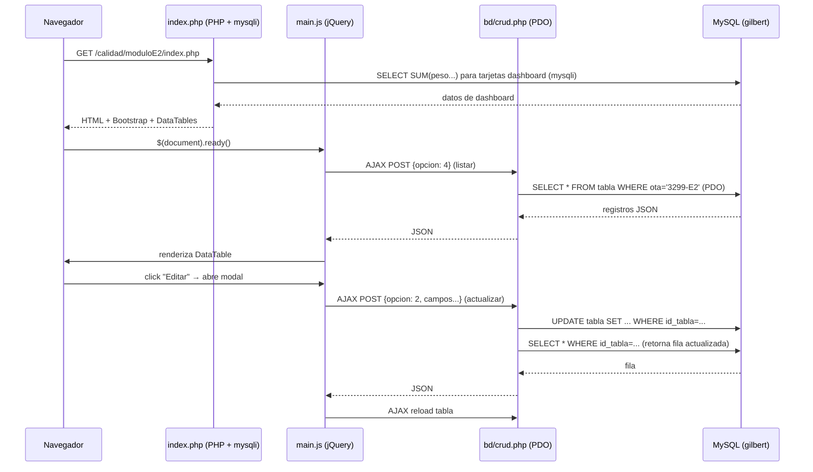

# Gilbert — Sistema de Seguimiento de Producción Industrial (Bootstrap 5)

> **Fecha de análisis:** 2026-08-20
> **Idioma del proyecto:** Español (México). Este README está en español para coincidir con el idioma del dominio y de los usuarios.

---

## 1. Project Overview

| Campo | Descripción |
| ----- | ----------- |
| **Nombre** | Gilbert (referenciado internamente como "Grupo Gilbert®") |
| **Tipo** | Aplicación web PHP clásica (sin framework, sin MVC formal, sin Composer) |
| **Descripción** | Sistema de seguimiento y control de producción para fabricación de estructuras metálicas. Gestiona el ciclo de vida de piezas/proyectos desde presupuesto, ingeniería, planeación (PCP), producción, materiales, calidad, embarques y recepción en obra. |
| **Objetivo** | Permitir que cada área de la empresa registre y consulte el avance de las piezas de un proyecto (OTA) en una tabla compartida, con tableros (dashboards) de peso y porcentaje de avance por área. |
| **Usuarios / caso de uso** | Personal interno de Grupo Gilbert por área: Presupuestos, Ingeniería, PCP, Producción, Materiales, Calidad, Embarques, Obra/Recepción y Contratistas. |
| **Estado actual** | **Prototipo funcional en desarrollo.** Solo el proyecto/OTA `3299-E2` ("MÓDULO E2") está implementado. Existe infraestructura para múltiples módulos (E2–N, Popocatépetl, Sunset, etc.) pero solo E2 tiene lógica backend. Sin autenticación real implementada. Conexiones a BD hardcodeadas. Ver §2. |

### Qué problema resuelve

Coordina el flujo de una pieza a través de múltiples áreas (ingeniería → PCP → producción → materiales → calidad → embarques → obra), todas leyendo y escribiendo sobre la **misma tabla** (`tabla`), donde cada área actualiza sus columnas. Esto evita que cada área mantenga su propia hoja de cálculo aislada.

---

## 2. Current Development Status

| Componente | Estado | Evidencia |
| ---------- | ------ | --------- |
| Módulo `presupuestos` | **Funcional** | CRUD completo (crear/editar/borrar/listar) sobre tabla `proyectos`. |
| Módulo `ingenieria/moduloE2` | **Funcional (parcial)** | UPDATE/DELETE + cancelar/reactivar piezas (opciones 5/6). **No crea registros** en `tabla` (sin `case 1` en `crud.php`, sin botón "Agregar" en `index.php`; `main.js` tiene handler `#btnNuevo` residual). Quién crea los registros de `tabla` es **No determinado**. |
| Módulos `pcp`, `produccion`, `materiales`, `calidad`, `embarques`, `obra_recepcion` (todos `/moduloE2`) | **Funcionales (parcial)** | Operan sobre `tabla` con `ota='3299-E2'`. Solo actualizan sus columnas (UPDATE) + listar (SELECT). No crean registros (ningún módulo principal hace `INSERT` en `tabla`). La "opción 3" en estos módulos **no elimina**, sino que reinicia/blanquea los campos del área. |
| Módulo `estimaciones/moduloE2` | **Funcional con inconsistencia** | Opera sobre `tabla`, pero su `index.php` conecta a BD `gilbertm_prueba` mientras su `crud.php` conecta a `gilbert`. Ver §23. |
| Subsistema `habilitados/*` | **Parcial / prototipo** | 4 áreas (calidad, contratista, ingenieria, produccion) sobre tabla `habilitados` (+ tabla `historial`). Apuntan a BD `gilbertm_prueba`. Las vistas `index.php` de listado de módulos tienen todos los botones `href="#"` (sin navegación real). |
| Autenticación / sesiones | **No implementado** | Solo existe `logout.php` (destruye sesión y redirige a `index.php`, que **no existe**). No hay `login.php`, no hay `session_start()` en ningún módulo, no hay `$_SESSION` leído en ninguna parte. |
| Navegación (`nav.html`) | **No encontrado** | Todos los `index.php` de módulos principales hacen `include 'nav.html'` pero el archivo **no existe** en el repositorio. |
| Hoja de estilos `css/app.css` | **No encontrada** | Referenciada por todos los módulos pero el directorio `css/` **no existe**. |
| Punto de entrada raíz (`index.php` / `areas.php`) | **No encontrado** | `logout.php` redirige a `index.php` (inexistente); `habilitados/*/moduloE2/index.html` enlazan a `../../areas.php` e `../index.php` (inexistentes). |
| Build / CI / tests / linting | **No existe** | Sin `composer.json`, sin `package.json`, sin configuración de test, sin CI. |
| `.gitignore` | **No existe** | Repositorio versionado sin `.gitignore`. |

---

## 3. Technology Stack

No existe `composer.json`, `package.json` ni ningún gestor de dependencias. Las versiones se infieren de las URLs de CDN en los `index.php`.

| Capa | Tecnología | Versión (de CDN) | Evidencia |
| ---- | ---------- | ---------------- | --------- |
| **Runtime** | PHP | No determinada (no hay `phpinfo` ni `composer.json`) | Inferido: sintaxis PHP moderna (clases, PDO). Requiere extensión `mysqli` y `pdo_mysql`. |
| **Servidor web** | Apache/Nginx con PHP | No determinada | Inferido: estructura de archivos suelta servida directamente. |
| **Base de datos** | MySQL / MariaDB | No determinada | `mysqli` y `PDO("mysql:...")`. |
| **ORM / acceso a datos** | Ninguno. SQL embebido con **dos APIs**: `mysqli` (dashboards) y `PDO` (CRUD AJAX). | — | Ver §9, §10. |
| **Frontend UI** | Bootstrap | 5.0.0-beta3 | CDN jsdelivr. |
| **Tablas de datos** | DataTables + DataTables Buttons | 1.10.24 / 1.6.5 | CDN datatables.net. |
| **JS base** | jQuery | 3.5.1 | CDN code.jquery.com. |
| **Exportación** | JSZip, pdfmake, vfs_fonts | 3.1.3 / 0.1.53 | CDN cloudflare/jsdelivr. |
| **Iconos** | Font Awesome | 5.15.3 | CDN cloudflare. |
| **Tipografía** | Google Fonts — Inter (300;400;600) | — | CDN googleapis. |
| **Estilos propios** | CSS plano (un `style.css` por módulo) | — | Archivos locales. |
| **Patrón AJAX** | jQuery `$.ajax` POST a `bd/crud.php` | — | — |
| **Testing** | No existe | — | — |
| **Linting** | No existe | — | — |
| **Despliegue** | No documentado | — | — |

---

## 4. Repository / Workspace Architecture

**Confirmado:** No es un monorepo ni un workspace. Es una **aplicación única PHP sin estructura de framework**, organizada por carpetas de área funcional.

No hay punto de entrada central (router). Cada área es una mini-aplicación independiente servida directamente por el webserver. La arquitectura es **"un módulo por carpeta"**, donde cada carpeta de área contiene su propio `index.php` (vista + dashboard), `main.js` (DataTables + AJAX) y `bd/conexion.php` + `bd/crud.php` (backend).



**Dos subsistemas coexisten:**

1. **Sistema principal** (carpetas raíz `presupuestos`, `calidad`, `ingenieria`, etc.) — opera sobre la tabla `tabla` con `ota='3299-E2'`. BD: `gilbert` (excepto `estimaciones/index.php`).
2. **Subsistema "habilitados"** (carpeta `habilitados/`) — opera sobre la tabla `habilitados` (+ `historial`). BD: `gilbertm_prueba`. Dominio distinto (gestión de piezas "habilitadas" con atributos físicos: perfil, espesor, largo, ancho, peso, colada, GUID/ensamble).

---

## 5. Project Scaffolding

```text
.
├── logout.php                      # Destruye sesión y redirige a index.php (inexistente)
├── bd/
│   └── conexion.php                # Conexión mysqli suelta (localhost/root/gilbert), sin usar
├── assets/                         # Imágenes sueltas (1.jpg, 2.jpg, logo.png)
├── presupuestos/                   # CRUD de proyectos (tabla: proyectos)
│   ├── index.php
│   ├── main.js
│   ├── style.css
│   └── bd/
│       ├── conexion.php            # PDO → gilbert
│       └── crud.php
├── ingenieria/moduloE2/            # CRUD de piezas (tabla: tabla, ota=3299-E2) — UPDATE/DELETE/cancelar
│   ├── index.php
│   ├── main.js
│   ├── style.css
│   └── bd/{conexion.php, crud.php}
├── pcp/moduloE2/                   # Planeación y control — libera piezas
├── produccion/moduloE2/            # Asigna contratista/consecutivo/folio
├── materiales/moduloE2/            # Asigna perfil y liberación de materiales
├── calidad/moduloE2/               # Inspección: armado/soldadura/limpieza/pintura/laboratorio
├── embarques/moduloE2/             # Gestiona envío y remisión
├── obra_recepcion/moduloE2/        # Recepción y montaje en obra
├── estimaciones/moduloE2/          # Estimaciones EPT/EPS/EPM (¡BD inconsistente!)
└── habilitados/                    # Subsistema de piezas "habilitadas" (tabla: habilitados + historial)
    ├── calidad/{index.php, moduloE2/}
    ├── contratista/{index.php, moduloE2/}
    ├── ingenieria/{index.php, moduloE2/}
    └── produccion/{index.php, moduloE2/}
```

Cada módulo `*/moduloE2/` replica la misma estructura: `index.php` + `main.js` + `style.css` + `bd/{conexion.php, crud.php}`.

### Propósito de cada directorio

| Directorio | Propósito |
| ---------- | --------- |
| `presupuestos/` | Gestión de proyectos y su estado de presupuesto (enviado/aceptado). Tabla `proyectos`. |
| `ingenieria/moduloE2/` | Captura y edición de datos base de piezas (marca, cantidad, peso, taller, revisión) + gestión de cancelados. **No crea** registros en `tabla` (sin `case 1`). |
| `pcp/moduloE2/` | Planeación y Control de Producción: libera piezas para producción (`liberado`, `fecha_liberado`, `fecha_termino_programada`). |
| `produccion/moduloE2/` | Asigna contratista, consecutivo, folio y fecha de producción. |
| `materiales/moduloE2/` | Asigna perfil de material y libera materiales. |
| `calidad/moduloE2/` | Inspección de calidad: armado, soldadura, limpieza, pintura, laboratorio. |
| `embarques/moduloE2/` | Gestiona envío, remisión y comentarios de embarque. |
| `obra_recepcion/moduloE2/` | Recepción en obra, montaje y contratista de embarques. |
| `estimaciones/moduloE2/` | Estimaciones de producto terminado/suministrado/montado (EPT/EPS/EPM). |
| `habilitados/` | Subsistema paralelo para gestión de piezas "habilitadas" (corte/ensamble) con atributos físicos detallados. |
| `bd/conexion.php` (raíz) | Conexión `mysqli` suelta, **no referenciada** por ningún módulo (posible leftover). |
| `assets/` | Recursos estáticos sueltos (imágenes). |

---

## 6. Applications / Modules / Packages

### 6.1 Módulos principales (tabla `tabla`, BD `gilbert`)

Cada módulo sigue el patrón idéntico. Difieren en **qué columnas actualizan**.

| Módulo | Ubicación | Responsabilidad (columnas que gestiona) | Crea registros | Estado |
| ------ | --------- | --------------------------------------- | -------------- | ------ |
| Presupuestos | `presupuestos/` | Estado de presupuesto del proyecto (tabla `proyectos`) | Sí (en `proyectos`) | Funcional |
| Ingeniería | `ingenieria/moduloE2/` | Datos base de pieza + `cancelados` | **No** (UPDATE/DELETE; ver §23) | Funcional (parcial) |
| PCP | `pcp/moduloE2/` | `taller`, `liberado`, `fecha_liberado`, `fecha_termino_programada` | No | Funcional |
| Producción | `produccion/moduloE2/` | `consecutivo`, `contratista`, `folio`, `fecha_produccion`, `fecha_termino_programada` | No | Funcional |
| Materiales | `materiales/moduloE2/` | `perfil`, `liberado_materiales` | No | Funcional |
| Calidad | `calidad/moduloE2/` | `armado`, `soldadura`, `limpieza`, `pintura`, `laboratorio`, `fecha_calidad`, `pendiente_calidad`, `comentarios_calidad` | No | Funcional |
| Embarques | `embarques/moduloE2/` | `enviado`, `fecha_enviado`, `remision`, `fecha_remision`, `comentarios_emb` | No | Funcional |
| Obra/Recepción | `obra_recepcion/moduloE2/` | `recibido`, `fecha_recepcion`, `montaje`, `fecha_montaje`, `contratista_embarques`, `tipo_obra` | No | Funcional |
| Estimaciones | `estimaciones/moduloE2/` | `ept`, `ept_fecha`, `eps`, `eps_fecha`, `epm`, `epm_fecha` | No | Funcional (con inconsistencia de BD) |

### 6.2 Subsistema `habilitados/` (tabla `habilitados` + `historial`, BD `gilbertm_prueba`)

| Módulo | Responsabilidad (columnas que gestiona) | Crea registros | Estado |
| ------ | --------------------------------------- | -------------- | ------ |
| `habilitados/ingenieria/moduloE2` | Datos completos de pieza habilitada (ota, ensamble, marca, colada, tipo, perfil, espesor, largo, ancho, peso, etc.) | Sí (INSERT completo) | Funcional |
| `habilitados/contratista/moduloE2` | `cortado`, `fecha_corte`, `entregado`, `fecha_entrega` | Sí (INSERT parcial) | Funcional |
| `habilitados/calidad/moduloE2` | `revision_corte`, `fecha_revision_corte`, `status`, `comentarios`, `revision_entrega`, `fecha_revision_entrega` + **INSERT en `historial`** | No | Funcional |
| `habilitados/produccion/moduloE2` | `pagado`, `fecha_pagado` | Sí (INSERT parcial) | Funcional |

---

## 7. Architecture and Data Flow

### Flujo típico de una operación (módulo principal)



### Patrón de operaciones (`opcion`)

Cada `crud.php` usa un `switch($opcion)`:

| `opcion` | Acción (módulos principales) | Acción (habilitados) |
| -------- | ---------------------------- | ------------------- |
| `1` | INSERT (solo `presupuestos`→`proyectos`; ingeniería tiene handler JS residual pero **sin `case 1` en `crud.php`**) | INSERT |
| `2` | UPDATE + SELECT de la fila actualizada | UPDATE + SELECT |
| `3` | DELETE (`presupuestos`, `ingenieria`) **o** blanquear campos (calidad, embarques, materiales, obra, estimaciones, pcp, produccion) | Blanquear campos **o** DELETE (ingeniería) |
| `4` | SELECT all (`WHERE ota='3299-E2'`) | SELECT all |
| `5` | (solo `ingenieria`) marcar `cancelados='SI'` | — |
| `6` | (solo `ingenieria`) desmarcar `cancelados=''` | — |

> **Atención:** La `opcion 3` tiene significados diferentes según el módulo. En `calidad`, `embarques`, `materiales`, `obra_recepcion`, `estimaciones`, `pcp` y `produccion` **no elimina el registro**, sino que `UPDATE` los campos del área a cadena vacía (reinicio). Solo `presupuestos` e `ingenieria` hacen `DELETE` real.

---

## 8. Frontend Architecture

No hay framework JS moderno (React/Vue/etc.). El frontend es **HTML generado por PHP + jQuery + Bootstrap 5 + DataTables**.

| Aspecto | Implementación |
| ------- | -------------- |
| **Routing** | No existe router. Cada URL es un archivo físico `.php`. Sin URL amigables. |
| **Layouts** | Cada `index.php` contiene el HTML completo (no hay layout reutilizable). Intentan `include 'nav.html'` que **no existe**. Los módulos `habilitados/*/index.php` usan una navbar con `include '../nav.html'` (tampoco existe). |
| **Componentes** | Bootstrap 5 nativo (cards, tablas, modales, formularios, selects). Sin librería de componentes propia. |
| **Tablas** | DataTables con: búsqueda por columna (inputs en tfoot), paginación, exportación a Excel (JSZip), idioma español. |
| **Formularios** | Form dentro de modal Bootstrap (`#modalCRUD`), submit interceptado por jQuery, enviado vía AJAX. |
| **Validación** | **No existe validación** ni cliente ni servidor. Los inputs se envían tal cual. |
| **Estado** | Sin gestión de estado. Variables JS locales por página. |
| **Fetching** | `$.ajax` POST a `bd/crud.php` con `opcion` como discriminador de operación. |
| **Manejo de errores** | **No existe manejo de errores** en el frontend. No hay `error` callback en los `$.ajax`. |
| **Permisos UI** | Solo `calidad/moduloE2/index.php` tiene un condicional `<?php if($tipo == 'ingenieria' || $tipo == 'Admin') { ?>` para mostrar columna ACCIONES, pero `$tipo` **no está definida** (ver §23). |
| **Coloreado de filas** | `createdRow` en DataTables pinta filas según `status_presupuestos` (verde=ACEPTADO, rojo=PENDIENTE, amarillo=ENVIADO, azul=RECHAZADO). |
| **Estilos** | Un `style.css` por módulo (CSS plano, ~34 líneas: colores de paginación y status). Referencian `css/app.css` que **no existe**. |
| **i18n** | Solo español, hardcodeado. Sin sistema de internacionalización. |

---

## 9. Backend Architecture

No hay arquitectura de backend formal (sin controllers, services, repositories, middlewares). Cada módulo es autónomo.

| Aspecto | Implementación |
| ------- | -------------- |
| **Bootstrap** | No existe. Cada `index.php` abre su propia conexión. |
| **Rutas** | No hay enrutador. Archivos físicos servidos directamente. |
| **Middlewares** | **No existen.** Sin auth middleware, sin CORS, sin validación de entrada. |
| **Controllers** | El `bd/crud.php` de cada módulo actúa como controller+service+data-access combinados. |
| **Services** | No existe capa de servicios. Lógica embebida en `crud.php`. |
| **Validación** | **Ninguna.** `(isset($_POST['x'])) ? $_POST['x'] : ''` sin sanitización. |
| **Autenticación** | **No implementada.** Ver §11. |
| **Acceso a datos** | **Dos APIs mezcladas:** `mysqli` procedural en `index.php` (dashboards) y `PDO` con `prepare()` en `crud.php` (operaciones AJAX). |
| **Manejo de errores** | PDO: `catch(Exception) → die(...)`. No hay logging. No hay códigos HTTP apropiados (todo responde 200). |
| **Respuesta** | `print json_encode($data, JSON_UNESCAPED_UNICODE)` — siempre JSON, sin estructura de error. |

### Patrón `conexion.php` (PDO, clase `Conexion`)

Cada módulo tiene su propia copia idéntica de `bd/conexion.php` con una clase `Conexion` estática. Difieren **solo en el nombre de la BD** (`gilbert` vs `gilbertm_prueba`).

### Patrón `index.php` (mysqli procedural)

Cada `index.php` abre conexión con `$conexion=mysqli_connect('localhost','root','','<bd>')` para los dashboards, **independientemente** de la conexión PDO del `crud.php`. Esto crea dos conexiones por módulo.

---

## 10. Database

### Tecnología y conexión

- **Motor:** MySQL / MariaDB (inferido; no hay schema `.sql` en el repo).
- **Host:** `localhost`
- **Usuario:** `root`
- **Password:** (vacío)
- **Sin migraciones, sin seeds, sin schema versionado.** El esquema debe crearse manualmente; **no está en el repositorio.**

> ⚠️ **No se encontró ningún archivo `.sql` de schema, migraciones ni seeds en el repositorio.** La estructura de tablas se infiere únicamente de las consultas SQL embebidas en `crud.php` e `index.php`.

### Bases de datos detectadas

| BD | Usada por | API |
| -- | --------- | --- |
| `gilbert` | `presupuestos`, `ingenieria`, `pcp`, `produccion`, `materiales`, `calidad`, `embarques`, `obra_recepcion` (todos `/moduloE2`) + `estimaciones/moduloE2/bd/conexion.php` (PDO) | mysqli (dashboards) + PDO (crud) |
| `gilbertm_prueba` | `habilitados/{calidad,contratista,ingenieria,produccion}/moduloE2` (PDO) + `estimaciones/moduloE2/index.php` (mysqli dashboard) | PDO (crud) + mysqli (dashboard) |

### Tablas y entidades (inferidas de SQL)

#### Tabla `proyectos` (BD `gilbert`)

Gestionada por `presupuestos`. Representa un proyecto/presupuesto.

| Columna | Tipo (inferido) | Notas |
| ------- | --------------- | ----- |
| `id_proyectos` | INT (PK, autoincrement) | — |
| `ota` | VARCHAR | Ej: `3299-E2` |
| `nom_pro` | VARCHAR | Nombre del proyecto |
| `direccion` | VARCHAR | — |
| `cliente` | VARCHAR | — |
| `peso_presupuestado` | DECIMAL | — |
| `enviado_presupuestos` | ENUM/VARCHAR | `SI`/`NO` |
| `fechaenvio_presupuestos` | DATE | — |
| `aceptado` | ENUM/VARCHAR | `SI`/`NO` |
| `fecha_aceptado` | DATE | — |
| `status_presupuestos` | VARCHAR | `ACEPTADO`, `PENDIENTE`, `ENVIADO`, `RECHAZADO` |

#### Tabla `tabla` (BD `gilbert`) — entidad central

Tabla **compartida** donde cada área escribe sus columnas. Clave del sistema. `ota` discrimina el proyecto (solo `3299-E2` activo).

Columnas inferidas (lista no exhaustiva; las consultas usan `SELECT *`):

| Columna | Gestiona | Notas |
| ------- | -------- | ----- |
| `id_tabla` | — | PK (INT autoincrement) |
| `ota` | ingenieria | Discriminador de proyecto (`3299-E2`) |
| `taller` | ingenieria, pcp | — |
| `revision` | ingenieria | — |
| `marca` | ingenieria | — |
| `consecutivo` | produccion | — |
| `cantidad` | ingenieria | — |
| `nombre` | ingenieria | — |
| `peso_unitario` | ingenieria | Base de cálculos de % en todos los dashboards |
| `contratista` | produccion | — |
| `folio` | produccion | — |
| `fecha_produccion` | produccion | — |
| `fecha_termino_programada` | pcp, produccion | — |
| `liberado` | pcp | `SI`/`NO` — libera a producción |
| `fecha_liberado` | pcp | Usado en `ORDER BY` de varios módulos |
| `perfil` | materiales | — |
| `liberado_materiales` | materiales | — |
| `armado`, `soldadura`, `limpieza`, `pintura`, `laboratorio` | calidad | `SI`/`NO` |
| `fecha_armado`, `fecha_soldadura`, `fecha_limpieza`, `fecha_pintura` | calidad | — |
| `fecha_calidad` | calidad | `NOW()` al actualizar |
| `pendiente_calidad` | calidad | — |
| `comentarios_calidad` | calidad | — |
| `status_calidad` | calidad (dashboard) | `TERMINADO`, `PENDIENTE`, `PROCESO`, etc. |
| `remision_ing` | ingenieria | — |
| `comentarios` | ingenieria | — |
| `liberado_ingenieria` | ingenieria | — |
| `enviado` | embarques | `SI`/`NO` |
| `fecha_enviado` | embarques | `NOW()` |
| `remision` | embarques | — |
| `fecha_remision` | embarques | — |
| `comentarios_emb` | embarques | — |
| `status_embarques` | (dashboard) | `TERMINADO` |
| `recibido` | obra_recepcion | `SI`/`NO` |
| `fecha_recepcion` | obra_recepcion | `NOW()` |
| `montaje` | obra_recepcion | — |
| `fecha_montaje` | obra_recepcion | `NOW()` |
| `contratista_embarques` | obra_recepcion | — |
| `tipo_obra` | obra_recepcion | — |
| `status_obra` | (dashboard) | `TERMINADO` |
| `ept`, `ept_fecha` | estimaciones | Estimación producto terminado |
| `eps`, `eps_fecha` | estimaciones | Estimación producto suministrado |
| `epm`, `epm_fecha` | estimaciones | Estimación producto montado |
| `producto_terminado`, `producto_suministrado`, `producto_montado` | estimaciones (SELECT) | — |
| `cancelados` | ingenieria | `SI`/`''` — soft-delete (marcar como cancelado) |
| `status_produccion` | (dashboard) | `TERMINADO` |
| `status_materiales` | (dashboard) | `TERMINADO` |

> La tabla `tabla` usa soft-delete parcial: `ingenieria` marca `cancelados='SI'` (opción 5) en lugar de borrar. Sin embargo, `ingenieria` **también** tiene `opcion 3` = `DELETE FROM tabla` real, y `presupuestos` también hace `DELETE` real. Comportamiento mixto.

#### Tabla `habilitados` (BD `gilbertm_prueba`)

Piezas "habilitadas" con atributos físicos detallados. Columnas inferidas:

`id_habilitados` (PK), `ota`, `id_ensamble` (GUID), `ensamble`, `num_ensamble`, `marca`, `colada`, `tipo`, `cantidad`, `perfil`, `espesor`, `largo`, `ancho`, `peso`, `fecha_captura`, `cortado`, `fecha_corte`, `entregado`, `fecha_entrega`, `revision_corte`, `fecha_revision_corte`, `status`, `fecha_status`, `comentarios`, `revision_entrega`, `fecha_revision_entrega`, `pagado`, `fecha_pagado`.

#### Tabla `historial` (BD `gilbertm_prueba`)

Registro de cambios de status de habilitados. Escrita **solo** por `habilitados/calidad/moduloE2/bd/crud.php`.

| Columna | Origen |
| ------- | ------ |
| `id_habilitados` | FK a `habilitados` |
| `status` | — |
| `fecha_status` | `NOW()` |
| `comentarios` | — |

### Convenciones de BD (observadas)

- **Naming:** snake_case para columnas y tablas.
- **Claves primarias:** `id_<tabla>` (ej: `id_tabla`, `id_proyectos`, `id_habilitados`).
- **Fechas:** `NOW()` para timestamps de acción; columnas `fecha_*` para fechas capturadas.
- **Sin foreign keys declaradas** (no hay schema para confirmar; las relaciones son lógicas).
- **Sin índices documentados** (No determinado).

---

## 11. Authentication & Authorization

| Aspecto | Estado |
| ------- | ------ |
| Login | **No implementado.** No existe `login.php`. |
| Sesiones | `logout.php` hace `session_start()` + `session_destroy()` + redirige a `index.php` (inexistente). Pero **ningún módulo** hace `session_start()` ni lee `$_SESSION`. |
| Tokens | No existen. |
| Cookies | No se gestionan (excepto sesión PHP nativa, no usada). |
| Roles | **No implementados formalmente.** Solo hay un rastro: `calidad/moduloE2/index.php` línea 166 usa `<?php if($tipo == 'ingenieria' || $tipo == 'Admin') { ?>` para mostrar/ocultar la columna ACCIONES, pero `$tipo` **nunca se define** en ese archivo (bug / deuda). |
| Guards / middlewares | **No existen.** Todos los endpoints `crud.php` son accesibles sin autenticación. |

> ⚠️ **Riesgo crítico:** Todos los endpoints CRUD son públicamente accesibles sin autenticación. Cualquiera con la URL puede leer, crear, modificar y eliminar registros.

---

## 12. API

No existe una API REST formal. La "API" son los endpoints `bd/crud.php` de cada módulo.

| Aspecto | Detalle |
| ------- | ------- |
| **Base URL** | Cada módulo es relativo a su carpeta: `/<modulo>/moduloE2/bd/crud.php` o `/presupuestos/bd/crud.php` |
| **Protocolo** | HTTP POST (siempre POST, incluso para lecturas) |
| **Autenticación** | Ninguna |
| **Request** | `application/x-www-form-urlencoded` con campos del formulario + `opcion` + `id_*` |
| **Response** | `application/json` (sin headers explícitos). Array de objetos o vacío. Sin estructura de error. |
| **Endpoints por módulo** | Un único endpoint (`bd/crud.php`) que multiplexa por `opcion`. |

### Grupos de endpoints

| Grupo | Endpoint | Operaciones (`opcion`) |
| ----- | -------- | ---------------------- |
| Presupuestos | `presupuestos/bd/crud.php` | 1=crear, 2=editar, 3=borrar, 4=listar |
| Ingeniería | `ingenieria/moduloE2/bd/crud.php` | 2=editar, 3=borrar, 4=listar, 5=cancelar, 6=reactivar |
| PCP | `pcp/moduloE2/bd/crud.php` | 2=editar, 3=reiniciar, 4=listar |
| Producción | `produccion/moduloE2/bd/crud.php` | 2=editar, 3=reiniciar, 4=listar |
| Materiales | `materiales/moduloE2/bd/crud.php` | 2=editar, 3=reiniciar, 4=listar |
| Calidad | `calidad/moduloE2/bd/crud.php` | 2=editar, 3=reiniciar, 4=listar |
| Embarques | `embarques/moduloE2/bd/crud.php` | 2=editar, 3=reiniciar, 4=listar |
| Obra/Recepción | `obra_recepcion/moduloE2/bd/crud.php` | 2=editar, 3=reiniciar, 4=listar |
| Estimaciones | `estimaciones/moduloE2/bd/crud.php` | 2=editar, 3=reiniciar, 4=listar |
| Habilitados (cada área) | `habilitados/<area>/moduloE2/bd/crud.php` | 1=crear, 2=editar, 3=reiniciar/borrar, 4=listar |

No existe cliente API compartido. Cada `main.js` hace sus propias llamadas `$.ajax` a su `bd/crud.php` relativo.

---

## 13. Environment Variables

**No existen variables de entorno.** No hay `.env`, `.env.example`, ni ningún mecanismo de configuración externa.

Todas las credenciales están **hardcodeadas** en los archivos `conexion.php` y `index.php`:

| Parámetro | Valor (hardcodeado) | Ubicaciones |
| --------- | ------------------- | ----------- |
| Host | `localhost` | Todos los `conexion.php` e `index.php` |
| Usuario | `root` | Todos |
| Password | (vacío) | Todos |
| BD (principal) | `gilbert` | 8 módulos principales + `estimaciones/crud.php` |
| BD (habilitados) | `gilbertm_prueba` | 4 módulos `habilitados/*` + `estimaciones/index.php` |

> ⚠️ **Riesgo de seguridad:** Las credenciales de BD (usuario `root` sin password) están embebidas en el código fuente versionado. No se reproducen valores sensibles adicionales porque no hay secretos aparte de esto.

---

## 14. Local Development

> ⚠️ **No existe documentación de setup en el repositorio.** Los pasos siguientes son **inferidos** de la estructura y configuración del código.

### Requisitos (inferidos)

1. Servidor web con soporte PHP (Apache + mod_php, o Nginx + PHP-FPM). **No determinado** cuál se usa oficialmente.
2. PHP con extensiones `mysqli` y `pdo_mysql`.
3. MySQL / MariaDB.

### Pasos (inferidos)

1. **Clonar el repositorio** en el `DocumentRoot` del servidor web (o un subdirectorio).
2. **Crear las bases de datos** manualmente:
   - `gilbert` (con tablas `proyectos`, `tabla`)
   - `gilbertm_prueba` (con tablas `habilitados`, `historial`)
   
   > **No existe schema `.sql` en el repositorio.** Las tablas deben recrearse a partir de las consultas SQL embebidas (ver §10). **Requiere confirmación** sobre si existe un dump externo.
3. **Configurar credenciales de BD:** editar cada `bd/conexion.php` e `index.php` si el entorno no usa `localhost`/`root`/password vacío.
4. **Crear los assets faltantes** (o acceptar que faltan): `css/app.css`, `nav.html`, `index.php` raíz, `areas.php`, `lg.png`. Sin estos, las páginas cargan con errores de include/404 de assets.
5. **Acceder** vía navegador a un módulo, por ejemplo: `http://localhost/presupuestos/index.php`.

### Puertos / URLs

No determinado (depende de la configuración del servidor web). Típicamente `http://localhost/` o `http://localhost/gilbert-bootstrap-5/`.

> **Punto de entrada no resuelto:** No hay `index.php` en la raíz del proyecto. El acceso directo a la raíz no renderiza nada útil. Se debe navegar manualmente a un módulo (ej: `presupuestos/index.php`).

---

## 15. Available Commands

**No existen scripts definidos.** No hay `package.json`, `composer.json`, ni `Makefile`.

El proyecto se ejecuta sirviendo los archivos PHP directamente desde un servidor web. No hay comandos `dev`, `build`, `lint`, `test`.

| Comando | Estado |
| ------- | ------ |
| `composer install` | No aplicable (sin `composer.json`) |
| `npm install` / `pnpm dev` | No aplicable (sin `package.json`) |
| Tests | No existen |
| Migraciones | No existen (esquema manual) |
| Seeds | No existen |

---

## 16. Build, Validation and Testing

| Tipo | Existe | Comando |
| ---- | ------ | ------- |
| Build | No | — |
| Typecheck | No (PHP no tiene typecheck por defecto; no hay PHPStan/Psalm) | — |
| Linting | No | — |
| Tests unitarios | No | — |
| Tests E2E | No | — |
| CI/CD | No | — |

> **No existe forma automatizada de validar cambios.** La única validación posible es manual: abrir el módulo en el navegador y verificar que la DataTable carga y los formularios funcionan. Si se dispusiera de PHP CLI, se podría hacer `php -l <archivo>` para verificar sintaxis, pero no está configurado como workflow.

---

## 17. Deployment and Environments

| Aspecto | Estado |
| ------- | ------ |
| Development | **Inferido:** servidor local con PHP + MySQL (Credenciales `localhost`/`root`/vacío sugieren entorno de desarrollo). |
| Staging/preview | **No determinado.** |
| Production | **No determinado.** Las credenciales hardcodeadas (`root` sin password) sugieren que **no** está en producción, o que la configuración de producción difiere y no está versionada. |
| Hosting | **No determinado.** |
| CI/CD | **No existe.** |
| Ramas | Rama `main` (de contexto git). **No determinado** si hay flujo de ramas. |
| Migraciones en deploy | No aplica (sin migraciones). |
| Variables de entorno por ambiente | No existen variables de entorno. |

> **Requiere confirmación** sobre el flujo de despliegue real. No hay evidencia en el repositorio.

---

## 18. Coding Conventions

### Reglas explícitamente documentadas

**Ninguna.** No existe `CONTRIBUTING.md`, `CLAUDE.md`, `AGENTS.md`, ni documento de convenciones.

### Convenciones observadas (inferidas del código)

| Convención | Patrón observado |
| ---------- | ---------------- |
| **Idioma** | Español (México) en toda la UI, comentarios y nombres de columnas. |
| **Estructura de módulo** | `index.php` + `main.js` + `style.css` + `bd/conexion.php` + `bd/crud.php`. |
| **Nomenclatura PHP** | Clases PascalCase (`Conexion`), métodos camelCase (`Conectar`). Variables snake_case. |
| **Nomenclatura BD** | snake_case en tablas y columnas. PK `id_<tabla>`. |
| **IDs HTML/JS** | camelCase (`btnNuevo`, `modalCRUD`, `tablaUsuarios`). |
| **Tabla principal** | Se llama literalmente `tabla` (nombre genérico). |
| **Conexión BD** | Clase `Conexion` con método estático `Conectar()` (PDO), duplicada en cada módulo. |
| **AJAX** | Siempre POST a `bd/crud.php` con `opcion` numérica. |
| **DataTables** | ID de tabla siempre `tablaUsuarios` (aunque gestione proyectos o piezas). |
| **Formularios** | ID `formUsuarios` (nombre genérico heredado, aunque gestione piezas/proyectos). |
| **CSS** | Un `style.css` por módulo, contenido casi idéntico (colores de status). |
| **Comentarios** | Mínimos. Algunos `<!--admin -->`, `<!-- Main -->`. |
| **Indentación** | Tabs en PHP/HTML, espacios en JS (inconsistente). |

---

## 19. Architectural Rules

> **No documentadas explícitamente.** Las siguientes son **inferidas** de la estructura del código.

1. **Cada módulo es autónomo:** no comparte código entre módulos. Cada uno tiene su propia copia de `conexion.php` y `crud.php`.
2. **Un único endpoint CRUD por módulo:** `bd/crud.php` multiplexa operaciones con `switch($opcion)`.
3. **La tabla `tabla` es compartida y de escritura por columnas:** cada área actualiza solo sus columnas, sin pisar las de otras áreas.
4. **Ningún módulo principal hace `INSERT` en `tabla`:** los registros de `tabla` solo se actualizan (UPDATE) o borran (DELETE). `ingenieria` es el módulo que gestiona los datos base y el ciclo de cancelación (opciones 5/6), pero **no crea** registros desde la UI actual (`main.js` tiene un handler `#btnNuevo`→`opcion=1` residual, pero `index.php` no incluye el botón y `crud.php` no tiene `case 1`). **Quién crea los registros de `tabla` es No determinado** (posiblemente vía carga manual o un módulo externo no versionado).
5. **`ota` discrimina el proyecto:** todo está filtrado por `ota='3299-E2'`. Para soportar otro proyecto, habría que duplicar la estructura de carpetas (`moduloE3`, etc.) y cambiar el valor de `ota` hardcoded.
6. **Soft-delete parcial:** `cancelados='SI'` para marcar piezas canceladas (en `tabla`); `DELETE` real en `presupuestos` e `ingenieria` (opción 3).
7. **Doble API de BD:** `mysqli` para dashboards inline en `index.php`, `PDO` para operaciones AJAX en `crud.php`.

### Librerías ya elegidas (no introducir alternativas sin razón)

- Bootstrap 5.0.0-beta3 (UI)
- jQuery 3.5.1 (DOM/AJAX)
- DataTables 1.10.24 (tablas)
- Font Awesome 5.15.3 (iconos)

---

## 20. How to Add New Functionality

### Nueva página / módulo de área

1. Crear carpeta `/<area>/moduloE2/`.
2. Copiar la estructura de un módulo existente (`index.php`, `main.js`, `style.css`, `bd/conexion.php`, `bd/crud.php`).
3. Ajustar el `SELECT` en `crud.php` (opción 4) con `WHERE ota='3299-E2'`.
4. Ajustar el `UPDATE` (opción 2) para escribir solo las columnas del área nueva.
5. Ajustar columnas de la DataTable en `main.js` y `index.php`.
6. Modificar la tabla `tabla` en la BD para añadir las columnas nuevas.

> **No existe automatización para esto.** Es copia manual y edición.

### Nuevo proyecto (distinto de E2)

1. Duplicar la estructura `moduloE2` → `moduloE3` (etc.) en cada área.
2. Reemplazar `3299-E2` por el nuevo OTA en todos los `crud.php` e `index.php`.
3. Las vistas `habilitados/*/index.php` ya listan múltiples módulos (E2–N, etc.) pero los botones son `href="#"` (no implementados).

### Nuevo componente UI

Usar componentes Bootstrap 5 nativos. No hay librería de componentes propia. El CSS está en `style.css` del módulo o en `css/app.css` (faltante).

### Nuevo endpoint

No hay patrón REST. Crear o modificar el `bd/crud.php` del módulo correspondiente añadiendo un `case` nuevo al `switch($opcion)`.

### Nueva entidad de BD

1. Crear la tabla manualmente en MySQL (no hay migraciones).
2. Crear un módulo siguiendo el patrón §20.
3. Documentar la tabla (no existe catálogo central; solo las consultas SQL).

### Nueva funcionalidad completa (frontend + backend + BD)

1. Añadir columnas a `tabla` (o crear tabla nueva) en MySQL manualmente.
2. Modificar `crud.php` del módulo para `UPDATE`/`SELECT` las columnas nuevas.
3. Modificar `index.php` para añadir columnas a la DataTable y campos al modal.
4. Modificar `main.js` para incluir los campos en el `columns` de DataTable y en el `data` del `$.ajax`.

---

## 21. Important Files

| Archivo / Directorio | Propósito |
| -------------------- | --------- |
| `presupuestos/bd/crud.php` | Referencia del patrón CRUD completo (crear/editar/borrar/listar). |
| `ingenieria/moduloE2/bd/crud.php` | Referencia de UPDATE/DELETE + cancelar/reactivar (opciones 5/6); nota: **no tiene `case 1`** (no crea registros en `tabla`). |
| `calidad/moduloE2/bd/crud.php` | Referencia de módulo que solo UPDATE (sin crear/borrar); usa `DATE_FORMAT`. |
| `presupuestos/bd/conexion.php` | Plantilla de la clase `Conexion` PDO (BD `gilbert`). |
| `habilitados/calidad/moduloE2/bd/conexion.php` | Variante de `Conexion` PDO (BD `gilbertm_prueba`). |
| `habilitados/calidad/moduloE2/bd/crud.php` | Único módulo que escribe en `historial` (auditoría de status). |
| `presupuestos/main.js` | Referencia completa del patrón DataTable + AJAX + modal + filtros. |
| `presupuestos/index.php` | Referencia de estructura de página (dashboard + tabla + modal). |
| `logout.php` | Único archivo con `session_start()` (aunque la sesión no se usa en el resto). |
| `bd/conexion.php` (raíz) | Conexión mysqli suelta, **no referenciada** (posible leftover). |

### Archivos referenciados pero inexistentes (rotos)

| Archivo referenciado | Referenciado por | Estado |
| -------------------- | ---------------- | ------ |
| `nav.html` | 8 módulos principales + 4 habilitados | **No existe** |
| `css/app.css` | 13 `index.php` | **No existe** |
| `index.php` (raíz) | `logout.php` (redirect) | **No existe** |
| `areas.php` | `habilitados/*/moduloE2/index.html` | **No existe** |
| `lg.png` | `habilitados/*/index.php` | **No existe** |
| `style.css` (habilitados) | `habilitados/*/index.php` | **No existe** (solo `moduloE2/index.html` existe) |

---

## 22. External Services and Integrations

| Servicio | Estado | Evidencia |
| -------- | ------ | --------- |
| MySQL / MariaDB | Implementado (local) | Conexiones `mysqli` y `PDO`. |
| Google Fonts (Inter) | Referenciado vía CDN | `<link>` a `fonts.googleapis.com`. |
| CDN jsdelivr / cloudflare / jquery.com | Referenciados | Bootstrap, DataTables, jQuery, Font Awesome, JSZip, pdfmake. |
| Email | No implementado | — |
| Pagos | No implementado | — |
| Almacenamiento de archivos | No implementado | — |
| Analytics | No implementado | — |

No se detectan integraciones con APIs externas de terceros más allá de los CDNs de librerías frontend.

---

## 23. Known Issues / Technical Debt

### Bugs / errores

| Issue | Evidencia | Severidad |
| ----- | --------- | --------- |
| **`$tipo` indefinida** en `calidad/moduloE2/index.php:166` | `<?php if($tipo == 'ingenieria' || $tipo == 'Admin') { ?>` — variable nunca definida en el archivo (warning PHP + columna ACCIONES siempre oculta porque `$tipo` es `null`). | Alta |
| **Inconsistencia de BD en `estimaciones`** | `index.php` (dashboard mysqli) → `gilbertm_prueba`; `bd/crud.php` (PDO) → `gilbert`. Las tarjetas del dashboard y los datos de la tabla pueden leer BDs distintas. | Alta |
| **Archivos referenciados inexistentes** | `nav.html`, `css/app.css`, `index.php` raíz, `areas.php`, `lg.png`, `style.css` en habilitados. Ver §21. | Alta |
| **`logout.php` redirige a `index.php` inexistente** | `header("Location: index.php")` — 404 al cerrar sesión. | Media |
| **Handler `#btnNuevo` residual en `ingenieria/moduloE2/main.js`** | `main.js:142` define `$("#btnNuevo").click(...)` con `opcion=1` (alta), pero `index.php` no incluye ningún botón `#btnNuevo` y `crud.php` no tiene `case 1`. Código muerto: no crea registros ni rompe nada, pero indica que la creación de piezas en `tabla` quedó sin implementar. | Media |

### Deuda técnica estructural

| Deuda | Detalle |
| ----- | ------- |
| **Sin autenticación** | Todos los endpoints CRUD son públicos. `logout.php` existe pero nada inicia sesión. |
| **Credenciales hardcodeadas** | `root` sin password en todos los `conexion.php` e `index.php`. Sin variables de entorno. |
| **SQL Injection** | Todas las consultas usan **interpolación de variables** (`"$variable"`) con `prepare()` pero **sin bind de parámetros**. `prepare()->execute()` no protege porque la consulta ya tiene el valor interpolado. Vulnerable a SQL injection. |
| **Duplicación masiva de código** | La clase `Conexion` se copia idéntica en 13 archivos. El patrón `main.js` se repite en 13 archivos. El `style.css` se repite casi idéntico en 9 archivos. |
| **Dos APIs de BD mezcladas** | `mysqli` procedural (dashboards) + `PDO` (crud) en cada módulo. |
| **Sin schema de BD versionado** | No hay `.sql`, migraciones ni seeds. El esquema solo existe en la BD. |
| **`opcion 3` ambigua** | Significa `DELETE` en algunos módulos y "blanquear campos" en otros. Propenso a errores. |
| **Sin `.gitignore`** | Repositorio versionado sin `.gitignore` (riesgo de commitear artefactos/sensibles). |
| **Nombre de tabla genérico** | La tabla central se llama `tabla`; el form se llama `formUsuarios`; la DataTable se llama `tablaUsuarios` incluso cuando gestiona piezas o proyectos. |
| **OTA hardcoded** | `3299-E2` está embebido en cada `crud.php` e `index.php`. Sin parametrización. |
| **Sin manejo de errores frontend** | Los `$.ajax` no tienen callback `error`. |
| **Sin validación de entrada** | Ni cliente ni servidor. |
| **Botones `href="#"`** en `habilitados/*/index.php` | Las tarjetas de módulos (E2–N, etc.) no navegan a ningún lado. |

---

## 24. Pending / Planned Work

### Claramente pendiente (con evidencia)

- **Implementar autenticación y sesiones:** existe `logout.php` pero no `login.php` ni `session_start()` en módulos. La variable `$tipo` en `calidad` sugiere intención de roles.
- **Implementar navegación entre módulos:** `nav.html` es referenciado pero no existe. Las tarjetas en `habilitados/*/index.php` apuntan a `href="#"`.
- **Crear punto de entrada raíz:** `index.php` (raíz) y `areas.php` son referenciados pero inexistentes.
- **Soportar múltiples módulos/proyectos:** la estructura `moduloE2` y los dashboards `habilitados/*/index.php` listan E2–N, Popocatépetl, Sunset, Chapultepec, Berna, E03–E12, Tepepan, Salamanca — pero solo E2 tiene lógica backend.

### Aparentemente pendiente (inferido)

- **Reconciliar las dos bases de datos** (`gilbert` vs `gilbertm_prueba`). **Requiere confirmación** sobre si es intencional o leftover de migración.
- **Crear `css/app.css`** o eliminar la referencia.
- **Versionar el schema SQL** de las tablas.

### Requiere confirmación

- Flujo de despliegue a producción.
- Si existe un dump `.sql` externo no versionado.
- Si la separación `gilbert` / `gilbertm_prueba` es intencional o un error.

---

## 25. Security Considerations

| Riesgo | Detalle |
| ------ | ------ |
| **SQL Injection** | 🔴 **Crítico.** Todas las consultas interpolan variables PHP directamente en el string SQL (`"... WHERE id_tabla='$id_tabla'"`) antes de `prepare()`. No se usa `?` placeholders ni `bindParam()`. |
| **Sin autenticación** | 🔴 **Crítico.** Todos los endpoints `bd/crud.php` son accesibles sin login. Operaciones destructivas (`DELETE`, `UPDATE` con blanqueo) expuestas. |
| **Credenciales en código** | 🟡 `root` sin password hardcodeado en 13+ archivos, versionado en git. |
| **Sin validación de entrada** | 🟡 `(isset($_POST['x'])) ? $_POST['x'] : ''` sin sanitización. |
| **Sin CSRF protection** | 🟡 Los formularios no usan tokens CSRF. |
| **Sin HTTPS forzado** | No determinado (depende del servidor). |
| **CORS** | No configurado (no hay headers CORS; los endpoints son same-origin por diseño). |
| **Exposición de errores** | 🟡 PDO usa `die("El error de Conexión es: ". $e->getMessage())` — expone detalles de error de BD al usuario. |
| **Operaciones destructivas sin confirmación server-side** | El `DELETE` en `presupuestos` e `ingenieria` solo tiene `confirm()` en JS (cliente). |
| **`.env` con secretos** | No aplica (no hay `.env`), pero las credenciales están en código plano. |

> **No se detectaron API keys, tokens, private keys ni connection strings con credenciales reales** más allá del usuario `root` sin password. No hay secretos adicionales que filtrar.

---

## 26. AI Session Context

> Antes de realizar cambios, considera este README como contexto base del proyecto. Verifica siempre el código actual antes de asumir que esta documentación sigue siendo exacta. Si realizas un cambio arquitectónico, estructural o de workflow que haga obsoleta alguna sección de este README, actualiza también este archivo dentro del mismo cambio.

### Before Making Changes

1. Leer este `README.md` completo.
2. Identificar el módulo específico afectado (carpeta `/<area>/moduloE2/` o `/presupuestos/`).
3. Leer el `index.php`, `main.js` y `bd/crud.php` del módulo concreto.
4. Verificar a qué BD apunta el `conexion.php` del módulo (`gilbert` o `gilbertm_prueba`).
5. Verificar qué columnas gestiona el módulo en la tabla `tabla` o `habilitados`.
6. Revisar si la funcionalidad toca el subsistema principal o el subsistema `habilitados`.

### Source of Truth

> `código actual > configuración actual > schema actual > README`

El README proporciona contexto, pero **el código debe verificarse antes de hacer cambios**. Ante discrepancias, el código actual manda.

### Non-Negotiable Conventions

1. **No introducir un framework** (Laravel, Symfony, etc.) sin autorización explícita — el proyecto es PHP plano.
2. **No introducir Composer/npm** sin razón explícita — actualmente no hay gestor de dependencias.
3. **No cambiar la estructura de un módulo** sin replicar el cambio en los demás (patrón `index.php` + `main.js` + `style.css` + `bd/{conexion,crud}.php`).
4. **No mezclar las BDs** `gilbert` y `gilbertm_prueba` sin entender por qué existen ambas.
5. **No asumir que `opcion 3` elimina** — en la mayoría de módulos blanquea campos, no borra.
6. **No crear `nav.html`, `css/app.css`, `index.php` raíz o `areas.php`** como parte de un cambio no relacionado — son huecos pendientes; documentarlos, no rellenarlos sin tarea explícita.
7. **No cambiar el OTA `3299-E2`** hardcoded sin replicar el cambio en todos los archivos del módulo.
8. **Reutilizar las librerías ya elegidas** (Bootstrap 5, jQuery, DataTables) — no introducir Tailwind, React, Vue u otras sin razón explícita.

### Validation Checklist

Después de modificar código, una IA debe:

- [ ] Verificar sintaxis PHP (`php -l <archivo>` si PHP CLI está disponible).
- [ ] Confirmar que el módulo afectado carga sin errores PHP en el navegador.
- [ ] Verificar que la DataTable popula datos (AJAX a `bd/crud.php` con `opcion: 4`).
- [ ] Si se modificó `crud.php`, probar crear/editar/listar manualmente.
- [ ] Si se tocó `conexion.php`, confirmar que la BD correcta (`gilbert` o `gilbertm_prueba`) sigue apuntando donde debe.
- [ ] Si se añadió una columna, verificar que existe en la BD MySQL (no hay migraciones automáticas).
- [ ] No romper el patrón de los demás módulos.
- [ ] Actualizar este `README.md` si el cambio es estructural.

### Documentation Sync Rule

Si una modificación cambia alguno de estos aspectos, **también debe actualizar `README.md`**:

- Arquitectura o patrón de módulo.
- Scaffolding o estructura de carpetas.
- Stack tecnológico o versiones de librerías.
- Scripts o comandos disponibles.
- Configuración de BD o credenciales.
- Variables de entorno.
- Módulos nuevos o eliminados.
- Flujo de datos o patrón de operaciones (`opcion`).
- Convenciones de naming o estructura.
- Despliegue o infraestructura.
- Decisiones arquitectónicas importantes.

---

## Context Snapshot

* Aplicación web PHP clásica sin framework ni Composer (Bootstrap 5 + jQuery + DataTables).
* Sistema de seguimiento de producción de estructuras metálicas por área (presupuestos → ingeniería → PCP → producción → materiales → calidad → embarques → obra).
* **Sin punto de entrada raíz**: no existe `index.php` en la raíz; se accede directo a cada módulo.
* Dos bases de datos: `gilbert` (sistema principal, tabla `tabla` + `proyectos`) y `gilbertm_prueba` (subsistema `habilitados`, tablas `habilitados` + `historial`).
* La tabla central se llama literalmente `tabla`; cada área actualiza solo sus columnas; `ota='3299-E2'` filtra el único proyecto activo.
* Ningún módulo principal hace `INSERT` en `tabla`; los registros se gestionan con UPDATE/DELETE. Quién crea los registros de `tabla` es No determinado (posible carga manual o módulo externo).
* Cada módulo replica: `index.php` (vista+dashboard con `mysqli`) + `bd/crud.php` (CRUD con PDO) + `main.js` (DataTables+AJAX) + `style.css`.
* Las operaciones se multiplexan con `switch($opcion)` en `crud.php` (1=crear, 2=editar, 3=borrar/blanquear, 4=listar, 5/6=cancelar/reactivar solo en ingeniería).
* **`opcion 3` NO siempre elimina**: en calidad/embarques/materiales/obra/estimaciones/pcp/produccion blanquea campos; solo presupuestos e ingeniería hacen `DELETE` real.
* Credenciales BD hardcodeadas: `localhost`/`root`/password vacío en todos los archivos.
* **Sin autenticación**: `logout.php` existe pero no hay `login.php`, ni `session_start()` en módulos, ni `$_SESSION` leído.
* **Vulnerable a SQL injection**: interpolación directa de variables en SQL con `prepare()` sin bind.
* Archivos referenciados inexistentes: `nav.html`, `css/app.css`, `index.php` raíz, `areas.php`, `lg.png`.
* No hay `composer.json`, `package.json`, `.gitignore`, migraciones, seeds, schema `.sql`, tests, linting, CI ni build.
* El subsistema `habilitados/` gestiona piezas con atributos físicos (perfil, espesor, largo, ancho, peso, colada) y registra auditoría en tabla `historial`.
* No existe validación de entrada ni manejo de errores en el frontend.
* Para validar cambios solo hay verificación manual (abrir el módulo en navegador).
* El README es la única documentación del proyecto; el código es la fuente de verdad.

---

## Session Startup Protocol

1. Lee este `README.md` completo antes de modificar el proyecto.
2. Inspecciona los archivos directamente relacionados con la tarea actual (`index.php`, `main.js`, `bd/conexion.php`, `bd/crud.php` del módulo concreto).
3. No asumas que el README reemplaza al código como fuente de verdad (`código actual > configuración actual > schema actual > README`).
4. Sigue las convenciones y abstracciones existentes (patrón `index.php` + `main.js` + `bd/{conexion,crud}.php`).
5. Evita introducir nuevas dependencias (Composer, npm) o frameworks (Laravel, React) si el proyecto ya tiene una solución para el mismo problema.
6. No realices refactors no relacionados con la tarea solicitada.
7. Ejecuta las validaciones relevantes después de modificar código (ver §26 Validation Checklist).
8. Actualiza este `README.md` si tu cambio modifica el contexto estructural del proyecto.

---

*Marcadores de certeza usados en este documento: **Confirmado** (evidencia directa en código), **Inferido** (deducido razonablemente), **No determinado** / **Requiere confirmación** (sin evidencia suficiente en el repositorio).*
